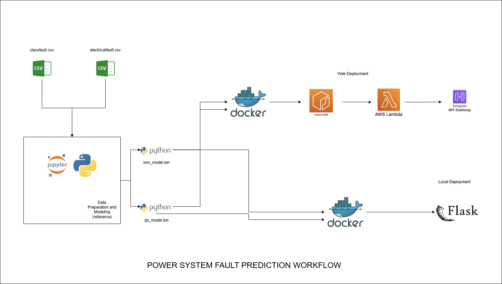

## POWER SYSTEM FAULT PREDICTION 

### Objective

This is a capstone project for the DTC ML Zoomcamp. A cloud deployed  ML project that has the objective of predicting if a fault exists and what type of fault does it belongs to in a simulated power system . The dataset is found on kaggle, for future reference, see the link below:

https://www.kaggle.com/datasets/esathyaprakash/electrical-fault-detection-and-classification

### Project Overview

There are two datasets that has been utilized. The first dataset (./data/electricalfault.csv) was used to determine whether or not a fault exists in a power system  while the second dataset (./data/classfault.csv) was used to classify where the fault is located from the combination of Phase A,B,C and Ground. 

Two models were created for each dataset and applied in cascaded manner , that if the first model determine that fault exist it will call out the second model to point out the location of the fault. 

The datasets were imported to a Jupyter Notebook were the data preparation to modeling was done. From the notebook, two pickled files were generated. 

    * knn_model.bin - for binary classification if a fault exists
    * gb_model.bin - for multilabel classification of where is the fault located 

For an overview of the whole project, please see the image below:




 - LOCAL DEPLOYMENT

The project was first tested on the a local deployment through the used of Flask and Docker. A virtual environment was created to isolate the dependencies and as a reference for the dockerfile image. The predict.py file contains the Flask Application and the test_flask.py contains an instance to test the deployment. The code for docker in local deployment is found below: 

```bash

FROM python:3.10

RUN pip install -U pip
RUN pip install pipenv 

WORKDIR  /app

COPY ["Pipfile", "Pipfile.lock","./"]

RUN pipenv install --system --deploy

COPY ["predict.py","gb_model.bin", "knn_model.bin","./"]

EXPOSE 9696

ENTRYPOINT ["gunicorn","--bind=0.0.0.0:9696","predict:app"]

```

Build and run the docker image  using the following commands :

```bash

docker build -t your_image_name:tag . 
docker run -it --rm -p 9696:9696 your_image_name:tag

```


- CLOUD DEPLOYMENT 

Upon successful local deployment, a new docker file was created (refer to the latest Dockerfile in repository) for cloud deployment. A new function named lambda_function.py was also written the contains the prediction and the lambda_handler function for interfacing. A separate test_aws.py was also coded to test the lambda_function.py. 

Next, the docker file was uploaded to Amazon ECR through the used of CLI with the following commands :


### AMAZON ECR 

1. Create repository 

```bash

aws ecr create-repository --repository-name your_repo_name

```


2. From the output,take note of the repositoryUri 

"repositoryUri": "0000000000000.dkr.ecr.us-east-1.amazonaws.com/your_repo_name"


3. Login to ECR

```bash

aws ecr get-login-password --region us-west-1 | docker login --username AWS --password-stdin 0000000000000.dkr.ecr.us-east-1.amazonaws.com

```

4. Upon successful login , Tag your Docker Image to be uploaded

```bash

CCOUNT=0000000000000
REGION=us-west-1
REGISTRY=your_imagename
PREFIX=${ACCOUNT}.dkr.ecr.${REGION}.amazonaws.com/${REGISTRY}
TAG=your_tagname
REMOTE_URI=${PREFIX}:${TAG}

docker tag localdockerimagename:latest ${REMOTE_URI}

```

5. Push the docker image to ECR 

```bash

docker push ${REMOTE_URI}

```


### AMAZON LAMBDA

Navigate to AWS Lambda in your AWS account, create a function and use the image you have pushed in ECR. 
Test the model under the Test Tab using json format . Please reference the test_aws.py data variable on how should the test data should be constructed.


### AWS API GATEWAY 

After successful testing on AWS Lambda, go to AWS API gateway and follow these steps: 

1. Create a REST API then create a resource.
2. Create a POST method using Lambda function as an integration type, load the lambda function. 
3. Deploy API  and input a stage name accordingly .
4. Copy the invoke url 

The invoke url should look something like this :

https://**********.execute-api.us-west-1.amazonaws.com/stage_name

Add the resource_name to the end of the url to fully utilized the link, as found below:

https://**********.execute-api.us-west-1.amazonaws.com/stage_name/resource_name

Reference the test_aws.py for testing the api gateway created.
